 - Importamos la maquina de Nginx 2 para hacer Nginx 3.

## Acceso seguro Nginx 

### Prerequisitos 
 - Tenemos que modificar el archivo sites-available y añadir en el name server esto:
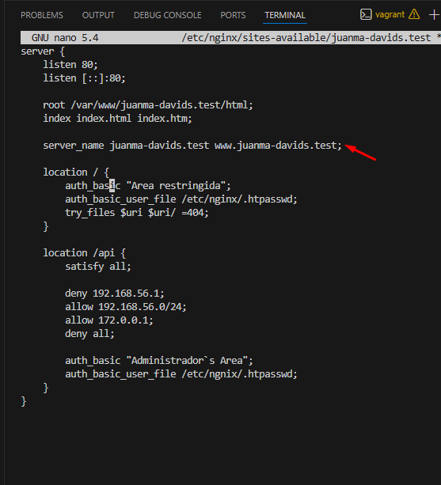
 - lo reiniciamos y comprobamos que no tenga ningun error de sintaxis con el comando sudo nginx -t

### Configuración de cortafuegos 
- lo intalamos la aplicacion ufw y comprobamos una vez se intale si está activo y los perfiles que tiene activos.
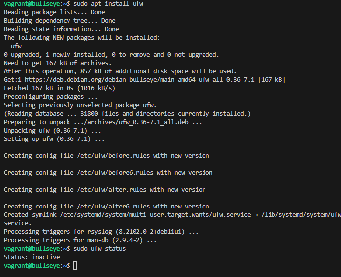
- Vemos que esta inactivo, así que vamos a activar los perfiles para permitir el trafico de https
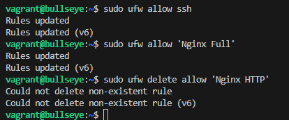
comprobamos ahora el status de nuevo y vemos si esta activo.
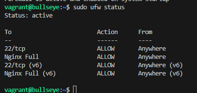

### Certificado autofirmado
 - Necesitamos crear una clave ssl y el certificado usamos el comando openssl. como es una sentencia larga para dividierlo en varias linea se utiliza "\"
   - comando utilizado 
        sudo openssl req -x509 -nodes -days 365 \
        -newkey rsa:2048 -keyout /etc/ssl/private/juanma-davids.test.key \
        -out /etc/ssl/certs/juanma-davids.test.crt
- y respondemos a las preguntas que nos hacer, como country etc...
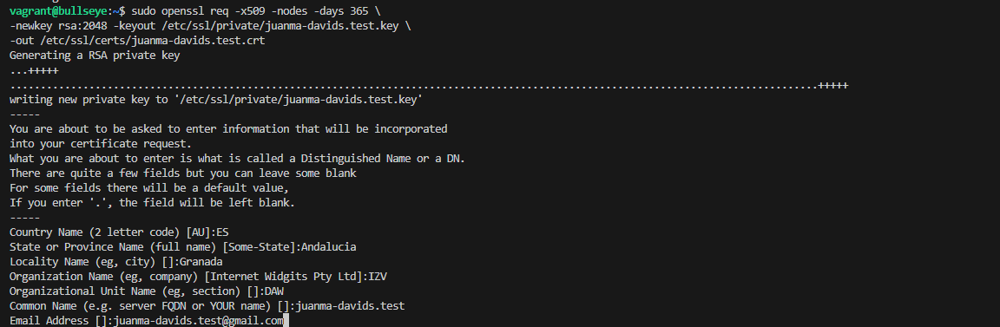
- Ahora configuramos el ssl, ahora vamos a nuestro sitio, (sites-available) y añadimos lo siguiente
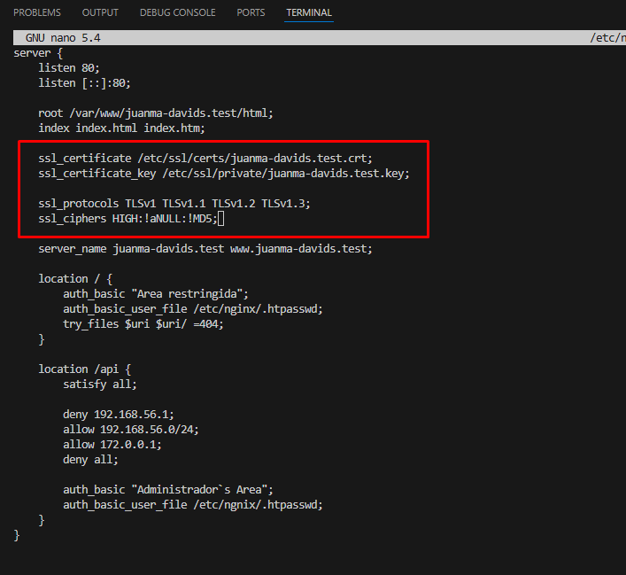
 - comprobamos que esta todo ok y reiniciamos el servicios
 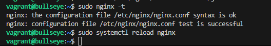
 - y por ultimo comprobar su funcionamiento en web.
   -  He cometido un error por lo cual no me funciona, lo que se me ha olvidado es poner en el sites-available el listen 443 ssl;
    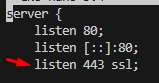 
 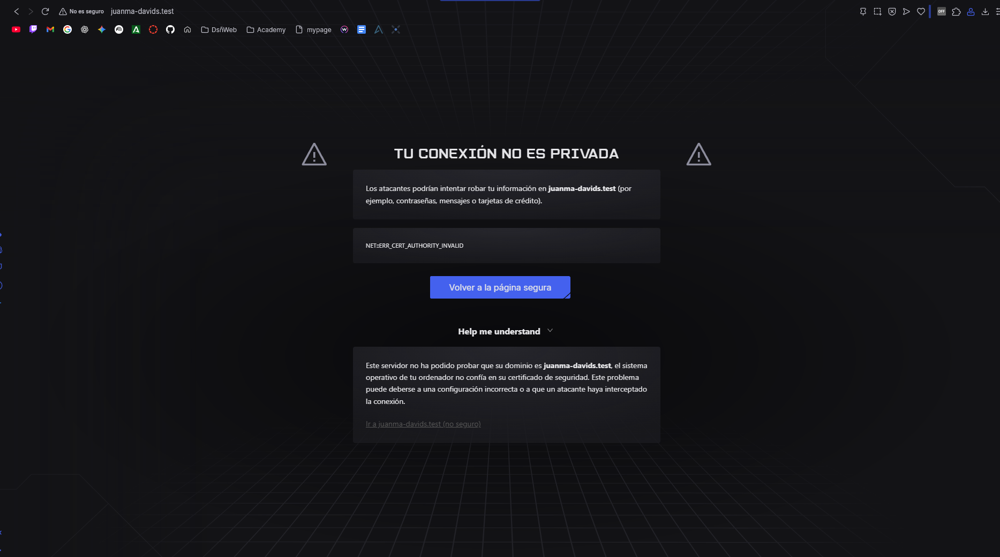 
si le damos a avanzado y continuar con la pagina ya nos dejaria entrar.
 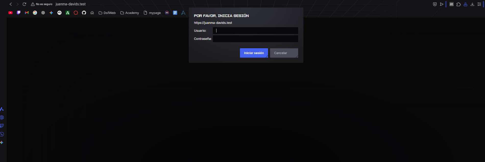 

## Configuracion Nginx
- En la practica Nginx creamos un archivo nuevo llamado conf, donde creare un bloc de notas donde pondre la ruta y un dominio de pruebas.

- Luego creo el dominio de pruebas. Para acceder a él necesitamos entrar como administrador a C:\Windows\System32\drivers\etc\hosts y añadimos esas dos ultimas lineas, la ruta y el dominio.

## Generar un certificado SSL
- Nos descargamos la imagen que genera certificados.
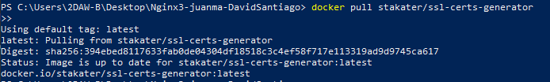
- Creamos certs en nuestra carpeta.

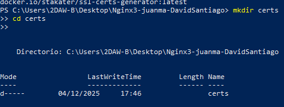
- Generamos los certificados dentro de certs.

## Configuracion
- Ahora que tengo el certificado, le voy a decir a Nginx que use el certificado que he descargado.
- Nos volvemos al .conf que habia creado, y lo configuro añadiendole las rutas creadas dentro del contenedor.
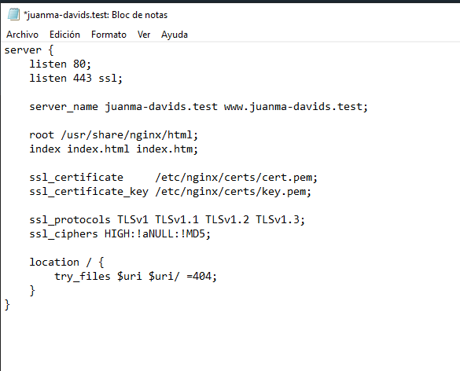
- Levantamos el Docker para ver si funciona.

- Lo ejecutamos en local para asegurarnos http://juanma-davids.test:8080

## Mapeo de puertos y montaje de volumen de certificados
- Cambiamos los puertos

## Docker Compose
- En vez de iniciar con Docker Run, lo hariamos con Docker Compose. Creamos Docker Compose en bloc de notas y añadimos los puertos y los volumenes.

- Levantamos con docker compose

- Compruebo con HTTP

- Y compruebo con HTTPS, nos saldra que es privada, asi que e daremos a Avanzado, y luego entraremos, significa que funciona correctamente.

